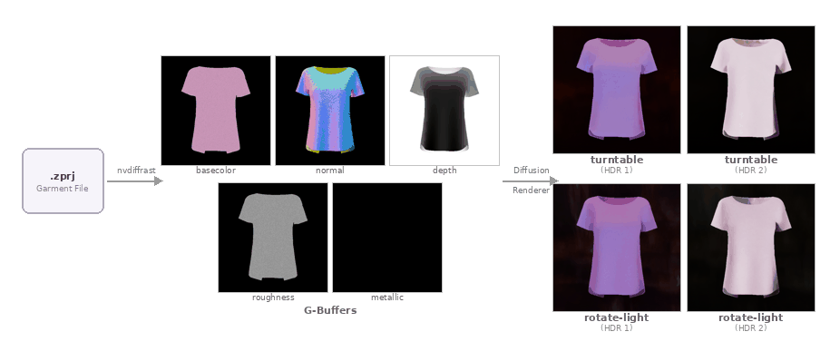

# CLO3D Garment Renderer

Render CLO3D garment files (`.zprj`) into photorealistic images using [DiffusionRenderer](https://arxiv.org/abs/2501.18590).



`.zprj` 파일에서 G-buffer(basecolor, normal, depth, roughness, metallic)를 추출한 뒤, diffusion forward renderer로 조명이 적용된 이미지를 생성합니다.

## Setup

```bash
# Python 3.10+, CUDA required
uv sync

# Download model weights
uv run utils/download_weights.py --repo_id nexuslrf/diffusion_renderer-forward-svd
```

## Usage

```bash
# 기본: 단일 이미지 렌더링
uv run render_zprj.py samples/garment.zprj

# HDR 환경맵 지정
uv run render_zprj.py samples/garment.zprj --hdr examples/hdri/pink_sunrise_1k.hdr

# 카메라 360도 회전 영상
uv run render_zprj.py samples/garment.zprj --mode turntable

# 조명 360도 회전 영상
uv run render_zprj.py samples/garment.zprj --mode rotate-light

# 컬러웨이 선택
uv run render_zprj.py samples/F12R063.zprj --colorway 0

# G-buffer만 렌더링 (forward rendering 없이)
uv run render_zprj.py samples/garment.zprj --gbuffer-only
```

### Options

| Argument | Default | Description |
|---|---|---|
| `input` | (required) | `.zprj` 파일 경로 |
| `--hdr` | `examples/hdri/sunny_vondelpark_1k.hdr` | HDR 환경맵 경로 |
| `--output` | `tmp/<filename>/` | 출력 디렉토리 |
| `--mode` | `still` | `still` / `turntable` / `rotate-light` |
| `--colorway` | active colorway | 컬러웨이 인덱스 |
| `--resolution` | `512` | 렌더 해상도 |
| `--fov` | `15.0` | 카메라 FOV (degrees) |
| `--gbuffer-only` | `false` | G-buffer만 저장, forward rendering 생략 |
| `--fps` | `10` | 영상 FPS (`turntable`, `rotate-light` 모드) |

### Output

```
tmp/<filename>/
├── basecolor.png    # 표면 색상
├── normal.png       # 노멀맵
├── depth.png        # 깊이맵
├── roughness.png    # 거칠기
├── metallic.png     # 금속성
├── rendered.png     # 렌더링 결과
├── turntable.mp4    # (--mode turntable)
└── rotate-light.mp4 # (--mode rotate-light)
```

## Architecture

- **G-buffer rendering**: [nvdiffrast](https://github.com/NVlabs/nvdiffrast) GPU rasterizer로 `.zprj` 메시에서 G-buffer 추출
- **Forward rendering**: [DiffusionRenderer](https://arxiv.org/abs/2501.18590) (Stable Video Diffusion 기반) forward model로 G-buffer + HDR envmap → photorealistic image 생성
- **zprj parsing**: [zprj_loader](https://github.com/clo3d/zprj_loader_python) 라이브러리로 CLO3D 파일에서 메시, 재질, 텍스처 추출

### Supported material features

- PBR material properties (metalness, roughness)
- Diffuse / normal / roughness / metallic texture maps
- Substance-generated DDS textures (auto-detected)
- Multiple colorways

## Credits

Forward rendering model: [DiffusionRenderer](https://research.nvidia.com/labs/toronto-ai/DiffusionRenderer/) (NVIDIA, CVPR 2025)
