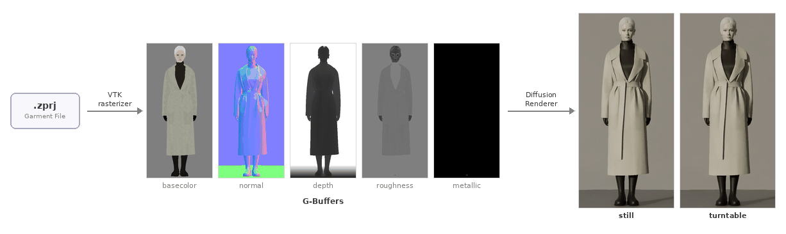
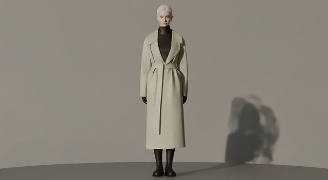

# CLO3D Garment Renderer

Render CLO3D garment files (`.zprj`) into photorealistic images using [DiffusionRenderer](https://arxiv.org/abs/2501.18590).



`.zprj` 파일에서 G-buffer(basecolor, normal, depth, roughness, metallic)를 추출한 뒤, diffusion forward renderer로 조명이 적용된 이미지를 생성합니다.

<p align="center">
  
</p>
<p align="center"><sub><code>samples/250000_coat.zprj</code> + <code>examples/hdri/sunny_vondelpark_1k.hdr</code></sub></p>

## Setup

```bash
# Python 3.10+, CUDA required
uv sync

# HuggingFace 로그인 (토큰 필요: https://huggingface.co/settings/tokens)
huggingface-cli login

# Download model weights (forward renderer + tokenizer)
uv run utils/download_weights.py

# inverse renderer 도 사용하려면
uv run utils/download_weights.py --model inverse
```

## Usage

```bash
# 기본: 단일 이미지 렌더링
uv run render_zprj.py samples/250000_coat.zprj

# HDR 환경맵 지정
uv run render_zprj.py samples/250000_coat.zprj --hdr examples/hdri/pink_sunrise_1k.hdr

# 카메라 360도 회전 영상
uv run render_zprj.py samples/250000_coat.zprj --mode turntable

# 조명 360도 회전 영상
uv run render_zprj.py samples/250000_coat.zprj --mode rotate-light

# G-buffer만 렌더링 (forward rendering 없이)
uv run render_zprj.py samples/250000_coat.zprj --gbuffer-only
```

컬러웨이는 `.zprj`에 저장된 active colorway가 자동으로 사용됩니다.

### Options

| Argument | Default | Description |
|---|---|---|
| `input` | (required) | `.zprj` 파일 경로 |
| `--hdr` | `examples/hdri/sunny_vondelpark_1k.hdr` | HDR 환경맵 경로 |
| `--output` | `output` | 출력 루트 디렉토리 (실제 저장 위치는 `<output>/<파일명>/`) |
| `--mode` | `still` | `still` / `turntable` / `rotate-light` |
| `--resolution` | `704 1280` | 렌더 해상도 (H W, 값 하나면 정사각형) |
| `--fov` | `10.0` | 카메라 FOV (degrees) |
| `--gbuffer-only` | `false` | G-buffer만 저장, forward rendering 생략 |
| `--fps` | `10` | 영상 FPS (`turntable`, `rotate-light` 모드) |
| `--gif` | `false` | MP4 대신 GIF로 저장 |
| `--device` | `cuda` | 연산 디바이스 |

### Output

출력 파일명에는 사용한 HDR 이름이 붙습니다 (예: `sunny_vondelpark_1k`).

```
output/250000_coat/
├── basecolor.png                        # 표면 색상
├── normal.png                           # 노멀맵
├── depth.png                            # 깊이맵
├── roughness.png                        # 거칠기
├── metallic.png                         # 금속성
├── rendered_sunny_vondelpark_1k.png     # 렌더링 결과 (모든 모드에서 저장)
├── turntable_sunny_vondelpark_1k.mp4    # (--mode turntable)
└── rotate-light_sunny_vondelpark_1k.mp4 # (--mode rotate-light)
```

## Other entry points

| Script | Description |
|---|---|
| `export_gbuffers.py` | `.zprj` → G-buffer PNG만 추출 (forward rendering 없음) |
| `render_forward.py` | 이미 저장된 G-buffer 디렉토리 → forward rendering, 결과는 `output/<디렉토리명>_rendered/`에 저장 (`--num-samples`, `--seed`로 여러 결과 생성) |
| `render_inverse.py` | 이미지/영상 → G-buffer 추정 (inverse renderer, `--model inverse` 가중치 필요) |
| `render_composite.py` | `.zprj` 가먼트를 배경 G-buffer 위에 합성해서 렌더링 |
| `serve.py` | 웹 데모 서버 (G-buffer 프리뷰 + 브라우저에서 forward/inverse 렌더링) |

```bash
# G-buffer만 추출 후 나중에 forward rendering
uv run export_gbuffers.py samples/250000_coat.zprj
uv run render_forward.py output/250000_coat/ --num-samples 4 --seed 42

# 이미지에서 G-buffer 추정
uv run render_inverse.py asset/examples/image_examples/image_1.jpg

# 웹 데모 (첫 실행 시 web/ 프론트엔드 자동 빌드, npm 필요)
uv run serve.py samples/250000_coat.zprj      # http://localhost:8080
```

## Architecture

- **G-buffer rendering**: [VTK](https://vtk.org/) offscreen 렌더러로 `.zprj` 메시에서 G-buffer 추출 (`utils/utils_render_vtk.py`)
- **Forward rendering**: [DiffusionRenderer](https://arxiv.org/abs/2501.18590) ([Cosmos Transfer1](https://github.com/nv-tlabs/cosmos-transfer1-diffusion-renderer) 7B FADiT 기반) forward model로 G-buffer + HDR envmap → photorealistic image 생성
- **Inverse rendering**: 같은 계열의 inverse model로 RGB 이미지/영상 → G-buffer 추정 (`render_inverse.py`)
- **zprj parsing**: [zprj_loader](https://github.com/clo3d/zprj_loader_python) 라이브러리로 CLO3D 파일에서 메시, 재질, 텍스처 추출

### Supported material features

- PBR material properties (metalness, roughness)
- Diffuse / normal / roughness / metallic texture maps
- Substance-generated DDS textures (auto-detected)
- Colorways (`.zprj`의 active colorway 사용)

## Credits

Forward rendering model: [DiffusionRenderer](https://research.nvidia.com/labs/toronto-ai/DiffusionRenderer/) (NVIDIA, CVPR 2025)
